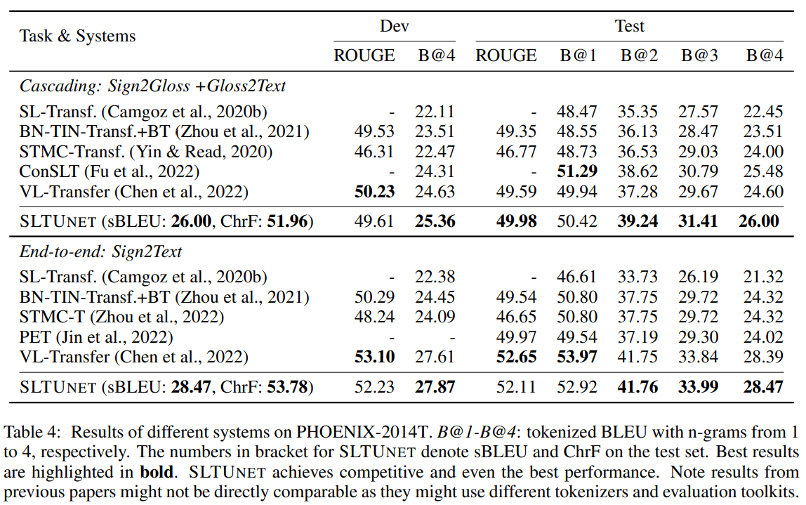

# SLTUNET: A Simple Unified Model for Sign Language Translation (ICLR 2023)

[**Paper**](https://openreview.net/forum?id=EBS4C77p_5S) | 
[**Highlights**](#paper-highlights) |
[**Overview**](#model-visualization) |
[**DGS3-T**](#dgs3-t) |
[**Training&Eval**](#training-and-evaluation) |
[**Model Performance**](#performance) |
[**Citation**](#citation)


* Update (2023/07/09): We release the trained model for phoenix and csldaily at [here](https://data.statmt.org/bzhang/iclr2023_sltunet/). See `infer.sh` for details.


## Paper Highlights

Among thousands of languages globally, some are written, some are spoken, while some are signed.
Sign languages are unique **natural** languages widely used in Deaf communities. They express
meaning through hand gestures, body movements and facial expressions, and are often in a video form.
We refer the readers to [Sign language Processing](https://research.sign.mt/) for a better understanding
of sign languages.

In this study, we aim at improving sign language translation, i.e. translating information from
sign languages (in a video) to spoken languages (in text). We address the video-text modality gap and 
the training data scarcity issue via multi-task learning and unified modeling. 

Briefly,
- We propose a simple unified model, SLTUNET, for SLT, and show that jointly modeling
multiple SLT-related tasks benefits the translation.
- We propose a set of optimization techniques for SLTUNET aiming at an improved trade-off
between model capacity and regularization, which also helps SLT models for single tasks.
- SLTUNET performs competitively to previous methods and yields the new state-of-the-art
performance on CSL-Daily.
- We use the DGS Corpus and propose [DGS3-T](#dgs3-t) for end-to-end SLT, with larger
scale, richer topics and more significant challenges than existing datasets.

## Model Visualization


## DGS3-T

* Similar to PHOENIX-2014T and CSL-Daily, DGS3-T is a dataset used for the study of SLT, consisting of sign videos and text translations.

* Different from these previous datasets, DGS3-T is larger at scale, covering broader domains and topics with more signers.

* DGS3-T represents more practical challenges in SLT. We encourage researchers to consider it for SLT research.


**DGS3-T Licensing**

DGS3-T is based on [the Public DGS Corpus](https://www.sign-lang.uni-hamburg.de/meinedgs/ling/license_en.html). The license of the Public DGS Corpus does not allow any computational research except if express
permission is given by the University of Hamburg.

**Constructing DGS3-T**

Please check out [dgs3-t](./dgs3-t) for details.

## Requirement

The source code is based on older tensorflow.

- python==3.8
- tensorflow==1.15


## Training and Evaluation

Training includes two phrase: 1) pretrain sign embeddings; 2) train SLTUNet model.

Please check out [example](./example) for details.


## Performance



Check out [our paper](https://openreview.net/forum?id=EBS4C77p_5S) for more results on CSLDaily and DGS3-T.

* Update (2023/04/02): note, for CSL-Daily, **we always adopt subword preprocessing (NOT character) for the target text 
and gloss sequence during training and inference**; 
We post-process the generated subword sequence into a character sequence at evaluation for char-level BLEU.

## Citation

If you draw any inspiration from our study, please consider to cite our paper:
```
@inproceedings{
zhang2023sltunet,
title={{SLTUNET}: A Simple Unified Model for Sign Language Translation},
author={Biao Zhang and Mathias M{\"u}ller and Rico Sennrich},
booktitle={The Eleventh International Conference on Learning Representations },
year={2023},
url={https://openreview.net/forum?id=EBS4C77p_5S}
}
```
