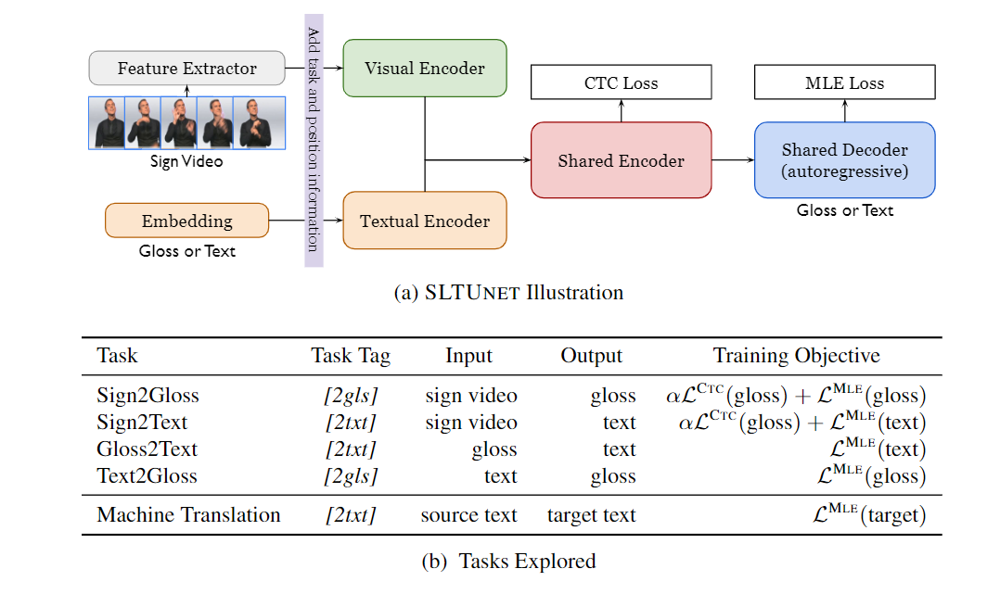

# SLTUNET: A Simple Unified Model for Sign Language Translation (ICLR 2023)

[**Paper**](https://openreview.net/forum?id=EBS4C77p_5S) | 
[**Highlights**](#paper-highlights) |
[**Overview**](#model-visualization) |
[**Training&Eval**](#training-and-evaluation) |
[**DGS3-T**](#dgs3-t) |
[**Model**](#pretrained-models) |
[**Citation**](#citation)

## Paper Highlights

Among thousands of languages globally, some are written, some are spoken, while some are signed.
Sign languages are unique **natural** languages widely used in Deaf communities. They express
meaning through hand gestures, body movements and facial expressions, and are often in a video form.
We refer the readers to [Sign language Processing](https://research.sign.mt/) for a better understanding
of sign languages.

In this study, we aim at improving sign language translation, i.e. translating information from
sign languages (in a video) to spoken languages (in text). We address the video-text modality gap and 
the training data scarcity issue via multi-task learning and unified modeling. 

Briefly,
- We propose a simple unified model, SLTUNET, for SLT, and show that jointly modeling
multiple SLT-related tasks benefits the translation.
- We propose a set of optimization techniques for SLTUNET aiming at an improved trade-off
between model capacity and regularization, which also helps SLT models for single tasks.
- SLTUNET performs competitively to previous methods and yields the new state-of-the-art
performance on CSL-Daily.
- We use the DGS Corpus and propose [DGS3-T](#dgs3-t) for end-to-end SLT, with larger
scale, richer topics and more significant challenges than existing datasets.

## Model Visualization

## Training and Evaluation

Training includes two phrase: 1) pretrain sign embeddings; 2) train SLTUNet model.

Please check out [example](./example) for details.
